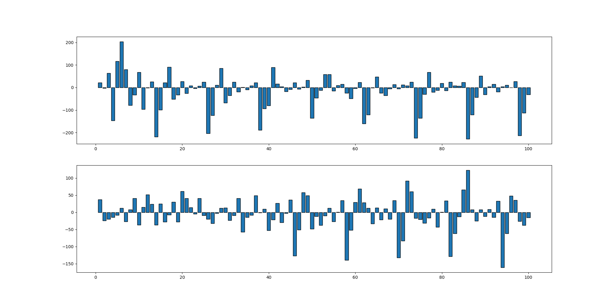

## Some spotify project for analysis

Im trying to read notes from song using `spotipy` and make them into actual music sheets.
using Air on G by Bach

For now it looks like this, very unsure on how this library interprets pitch/timbre. will see :shrug:

